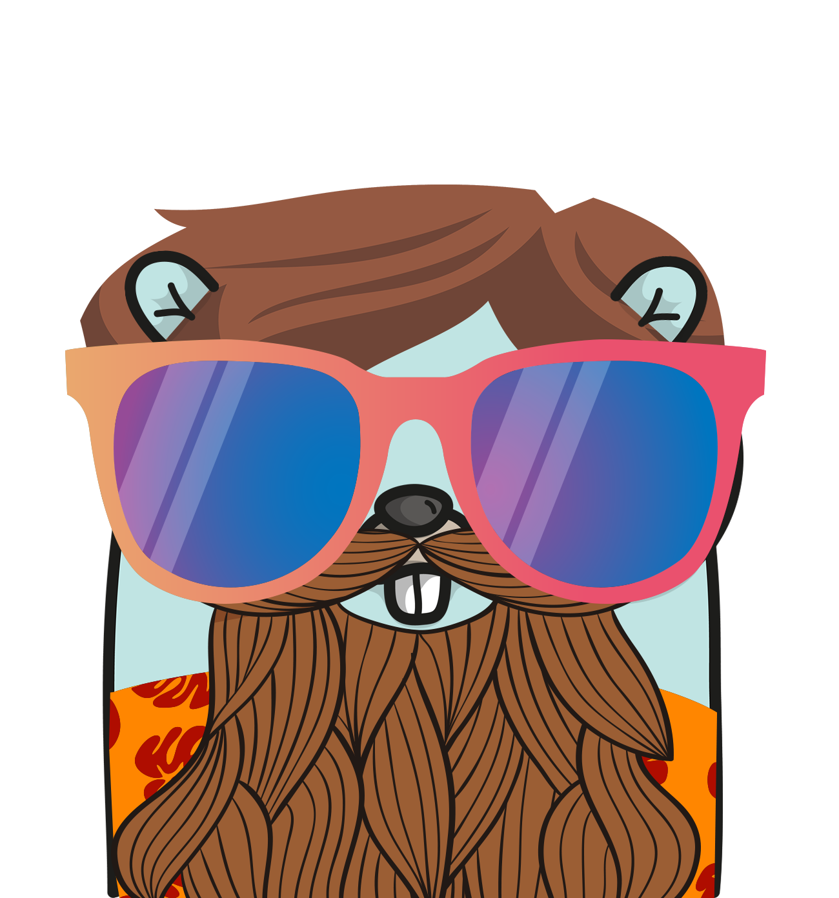

> ⚠️ Broken as of macOS 14

<h1>
  <span>screengopher</span>
  
</h1>

Ever wanted to run the macOS screensaver from the Spotlight? So did I.

Say `Hi` to the most basic Go script in the literal world with more shell scripting around it than actual Go code.

## Building

```shell
./build.sh
```

By default, this will generate the executable binary in `./bin`, as well as package up a barebones, unsigned macOS app bundle in `./pkg`.

The benefit of the macOS app is that a terminal window will not be opened when executed from Spotlight Search.

## Running

1. Super+Space
2. Type "Screengopher"
3. ??? (I don't know that's none of my business)
4. Profit

## Additional Info

> Tom, you're dumb.
>
> \- Someone, probably
